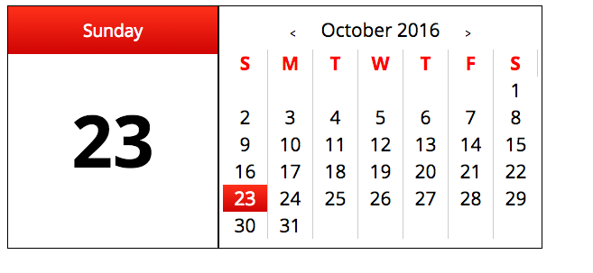

#Calendar

User can change months with arrow icons and keyboard keys. On load the current date is displayed on the left and will change on click to another date.

Technologies: JavaScript, HTML, CSS

Deployed Link: https://echeng924.github.io/Calendar_Code_Challenge/
